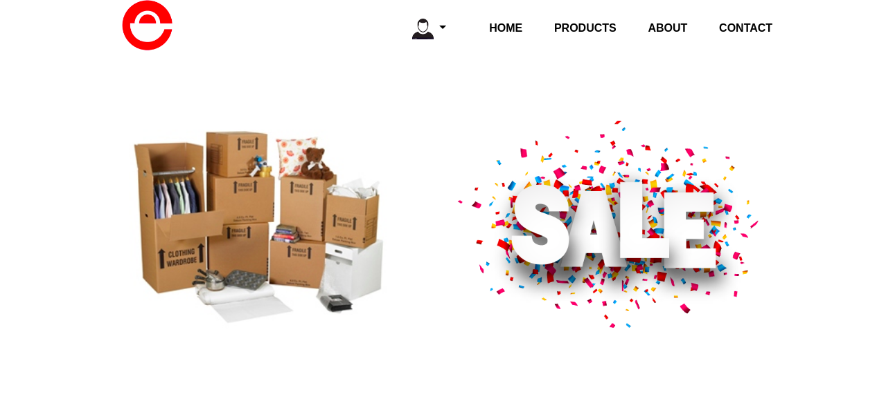
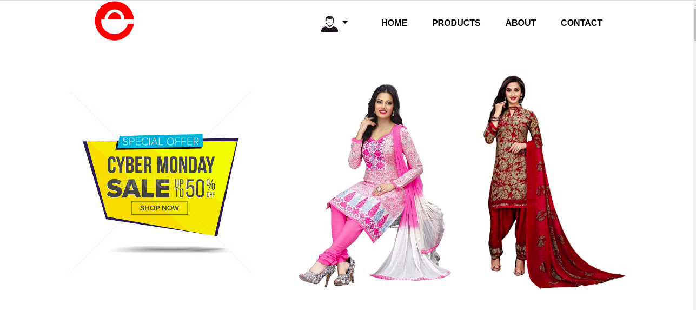
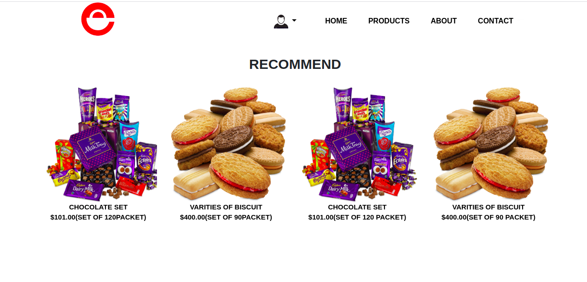
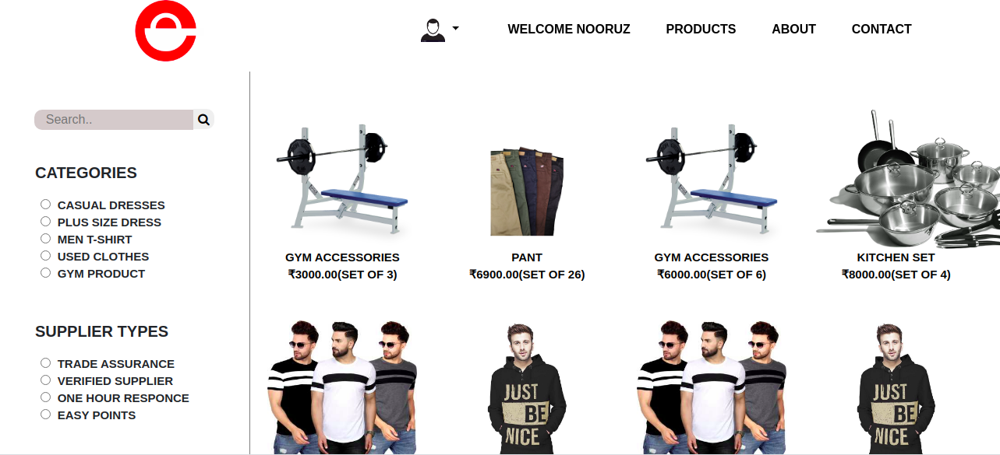
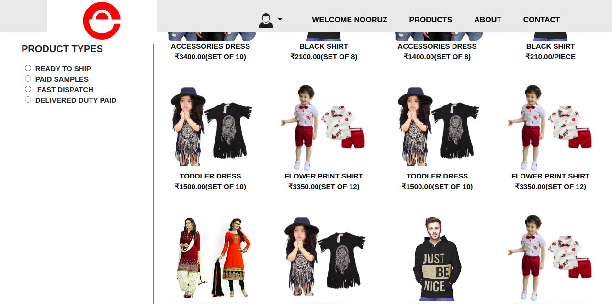
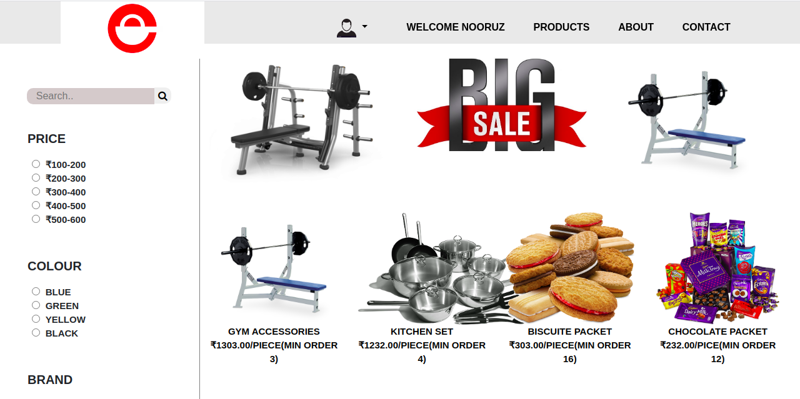
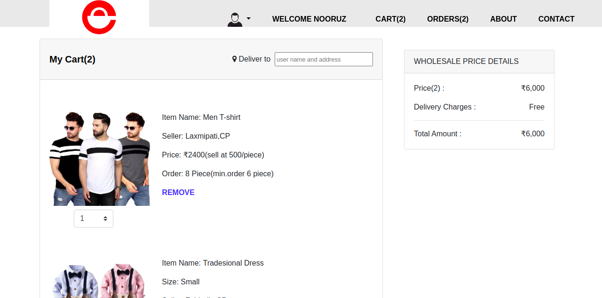
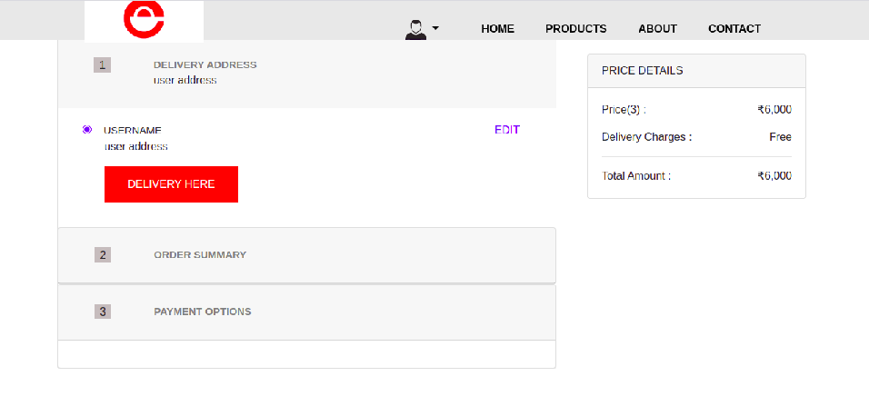
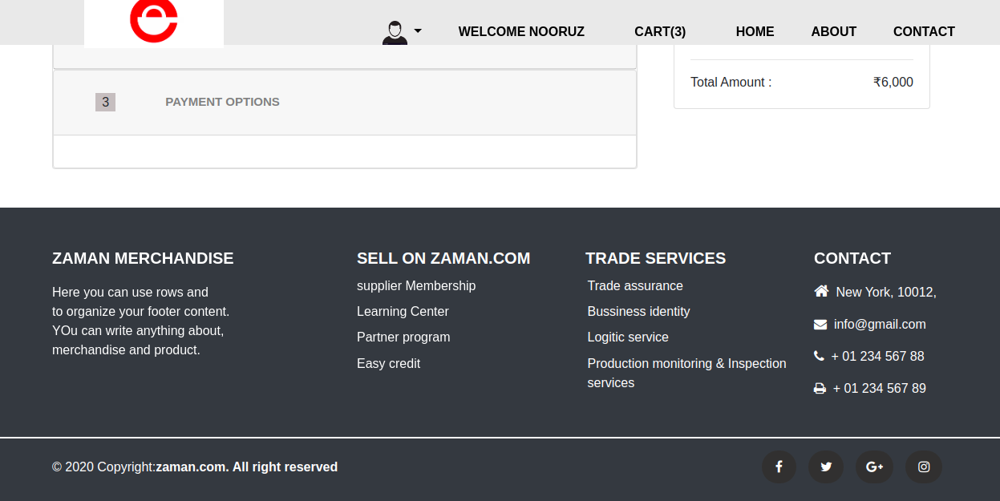
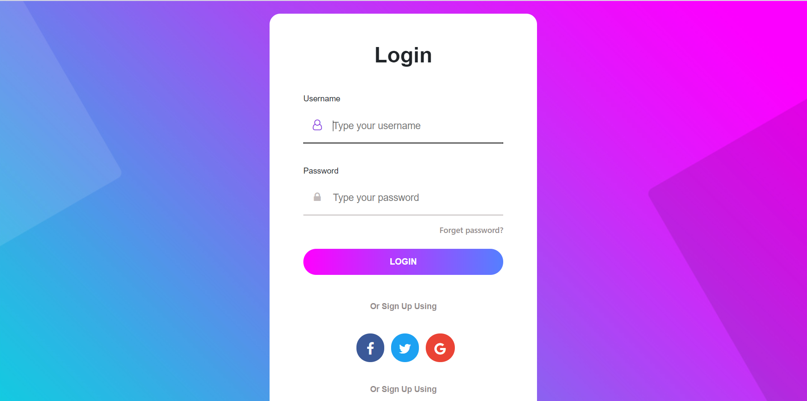

# wholesale-Ecommerce-Website
Front-end for an wholesale-Ecommerce selling website.
Also try to implement MVC framework. 
## About
It is wholesale ecommerce website (B2B ecommerce) model where, instead of selling your products individually to consumers you sell them in bulk and at a discount to other businesses.
within supply chain, we actually providing the services.
Target audience are small vendors and Suppliers are large vendors. 
1- It is a wholesale webpage containing nice animations.  
2- Contains a well authenticated contact, login and sinup froms. 
3- Contains many categories regarding clothes,gym and chocolate. 
4- A small vendors can buy stuff easily. 
5- Authenticated Payment Page. 
5- A nice Cart Page. 
6- A B2B bussines. 
## Screenshots

Hope you liked it...!
